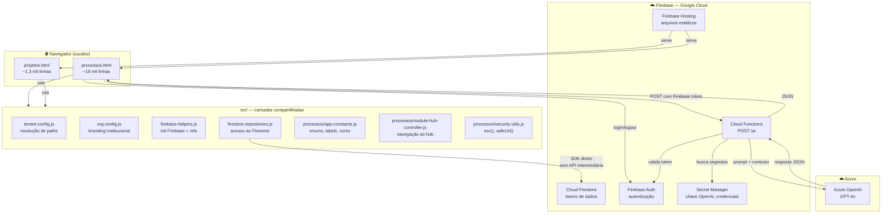
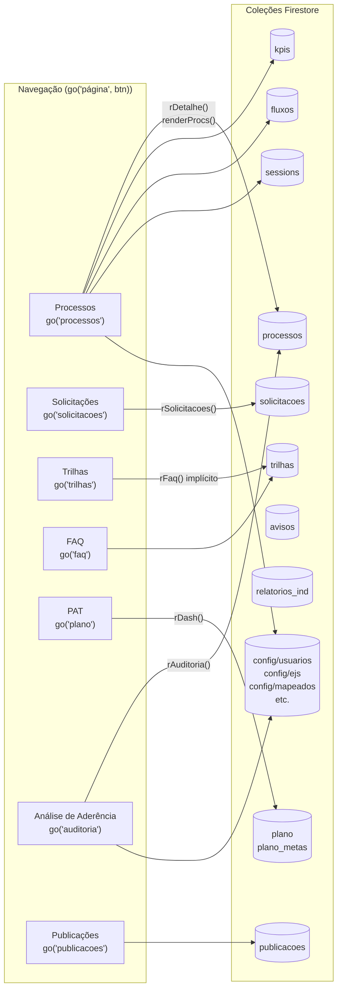
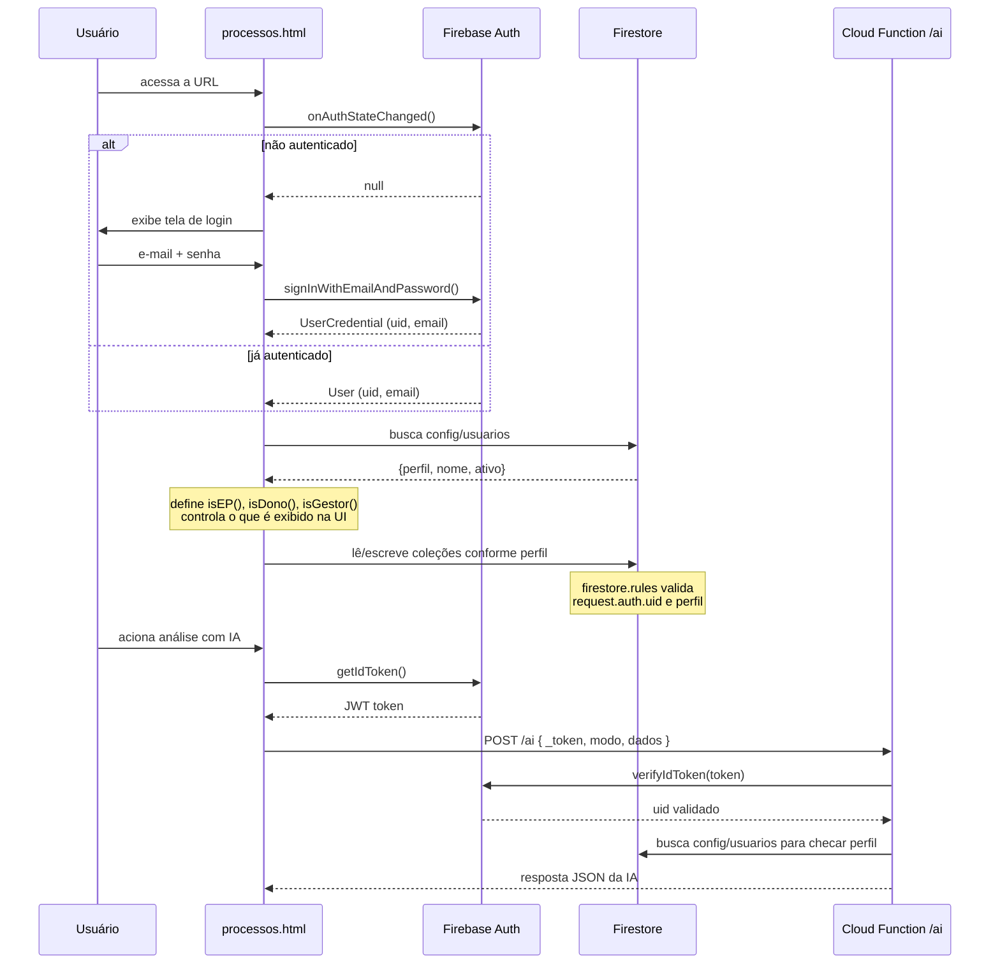
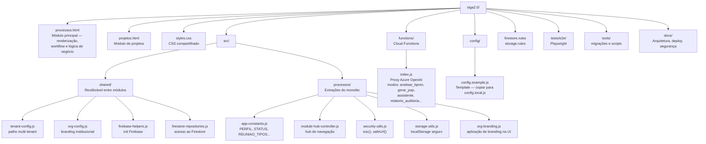

# Diagrama de Arquitetura — SIGA 2.0

Mapas visuais para onboarding técnico. Renderizam diretamente no GitHub e em qualquer editor Mermaid.

---

## 1. Topologia do sistema

Como as peças se conectam em produção.

> **Ponto crítico para onboarding:** não existe API REST entre o frontend e o Firestore — o browser chama o Firestore diretamente via SDK. Toda a lógica de autorização fica nas `firestore.rules`. A única passagem por servidor é o proxy `/ai` na Cloud Function.

---

## 2. Módulos do frontend e suas coleções Firestore

Cada módulo de navegação, qual função o renderiza e quais coleções lê/escreve.

> **Atenção:** `processos` é a coleção mais acessada — armazena não só os dados básicos mas também todo o estado do mapeamento: etapas, formulários, reuniões, indicadores, POP, análise de aderência e histórico de acompanhamento. Um único documento pode ter centenas de campos.

---

## 3. Camada de dados — como o código acessa o Firestore

```mermaid
graph TD
  UI["UI (processos.html)"]

  subgraph Repos["src/shared/firestore-repositories.js"]
    RP["processosRepository"]
    RK["kpisRepository"]
    RS["solicitacoesRepository"]
    RT["trilhasRepository"]
    RPL["planoRepository / planoMetasRepository"]
    RPB["publicacoesRepository"]
    RA["avisosRepository"]
    RRI["relatoriosIndicadoresRepository"]
    RF["fluxosRepository"]
    RSE["sessoesRepository"]
    RPJ["projetosRepository"]
    RPG["programasRepository"]
    RC["configRepository\n(config/usuarios, config/ejs, etc.)"]
  end

  subgraph FS["Cloud Firestore"]
    processos[("processos")]
    kpis[("kpis")]
    solicitacoes[("solicitacoes")]
    trilhas[("trilhas")]
    plano[("plano")]
    plano_metas[("plano_metas")]
    publicacoes[("publicacoes")]
    avisos[("avisos")]
    relatorios_ind[("relatorios_ind")]
    fluxos[("fluxos")]
    sessions[("sessions")]
    projPROJETOS[("projPROJETOS")]
    projPROGRAMAS[("projPROGRAMAS")]
    config[("config/{doc}")]
  end

  UI --> RP --> processos
  UI --> RK --> kpis
  UI --> RS --> solicitacoes
  UI --> RT --> trilhas
  UI --> RPL --> plano & plano_metas
  UI --> RPB --> publicacoes
  UI --> RA --> avisos
  UI --> RRI --> relatorios_ind
  UI --> RF --> fluxos
  UI --> RSE --> sessions
  UI --> RPJ --> projPROJETOS
  UI --> RPG --> projPROGRAMAS
  UI --> RC --> config
```

> **Regra de desenvolvimento:** nenhuma nova chamada `.collection()` ou `.doc()` deve ser adicionada diretamente no HTML. Todo acesso novo ao Firestore deve passar pelos repositórios em `firestore-repositories.js`.

---

## 4. Fluxo de autenticação

---

## 5. Pipeline de mapeamento de processo

Fases e etapas que um processo percorre, com os perfis responsáveis.

```mermaid
graph LR
  subgraph ENT["Fase: Entendimento 🔵"]
    E1["Abertura\n(EP)"]
    E2["Reunião de\nentendimento\n(EP)"]
    E3["Quest. maturidade\n(Dono)"]
  end

  subgraph MOD["Fase: Modelagem 🟣"]
    M1["Esboço AS IS\n(EP)"]
    M2["Det. e Validação\nAS IS\n(Dono)"]
    M3["Identificação\nde riscos\n(EP)"]
    M4["Análise\ninteligente\n(EP)"]
    M5["Melhorias /\nTO BE\n(EP)"]
  end

  subgraph FORM["Fase: Formalização 🟠"]
    F1["Indicadores\n(EP)"]
    F2["Construção\nPOP\n(EP)"]
    F3["Aprov. Gestor\n(Gestor)"]
    F4["Publicação\n(EP)"]
  end

  subgraph OP["Fase: Operação 🟢"]
    O1["Acompanhamento\n(EP)"]
  end

  subgraph ADE["Fase: Análise de Aderência 🔴"]
    A1["Análise de\nAderência\n(EP)"]
  end

  E1 --> E2 --> E3 --> M1 --> M2 --> M3 --> M4 --> M5
  M5 --> F1 --> F2 --> F3 --> F4 --> O1 --> A1
```

---

## 6. Estrutura de arquivos — onde fica o quê

---

## Referências rápidas

| O que encontrar | Onde procurar |
|---|---|
| Enums de perfil, status, cores | `src/processos/app-constants.js` |
| Inicialização do Firebase | `src/shared/firebase-helpers.js` |
| Qualquer acesso ao Firestore | `src/shared/firestore-repositories.js` |
| Branding (nome do órgão, logo) | `src/shared/org-config.js` + `config/config.local.js` |
| Sanitização de HTML/URL | `src/processos/security-utils.js` — `esc()` e `safeUrl()` |
| Funções de renderização de página | `processos.html` — buscar `function r` ou `function render` |
| Regras de segurança Firestore | `firestore.rules` |
| Deploy CI/CD | `.github/workflows/firebase-deploy.yml` |
| Como configurar localmente | `SETUP_LOCAL.md` + `config/README.md` |
| Dívidas técnicas e roadmap | `docs/architecture/` |
